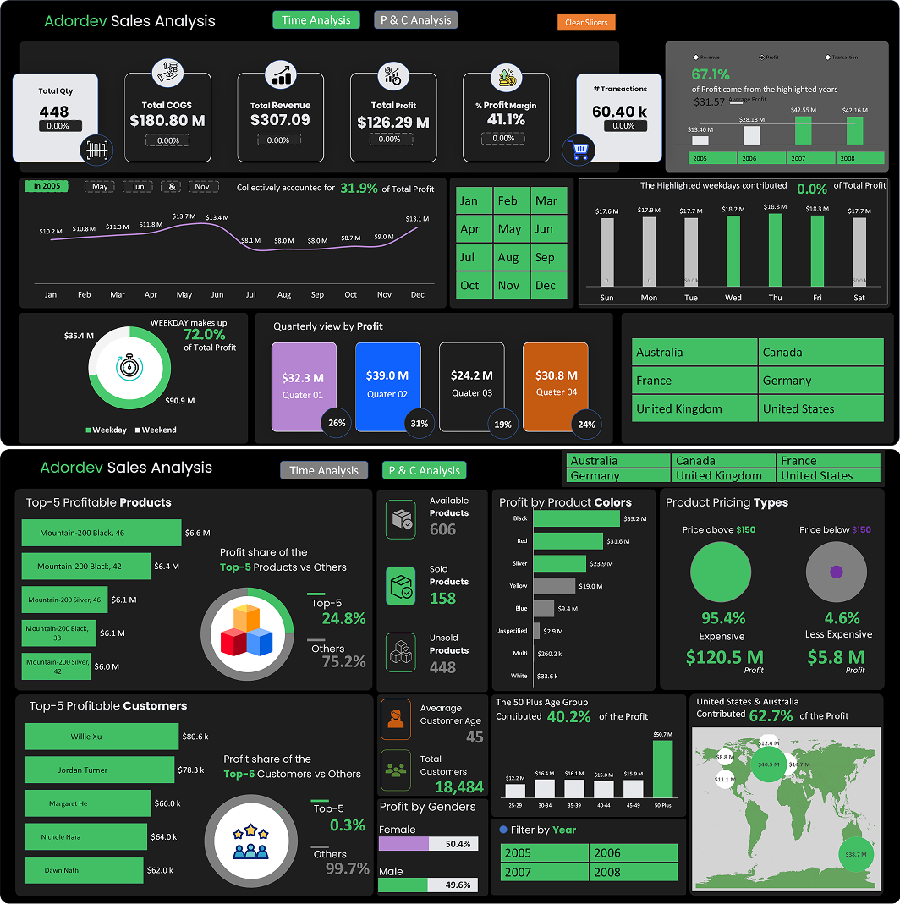
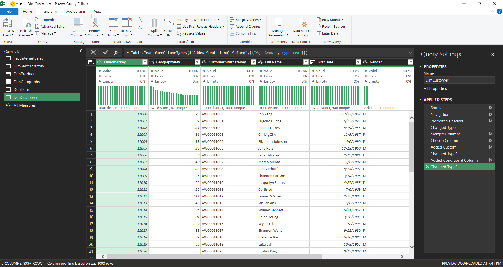
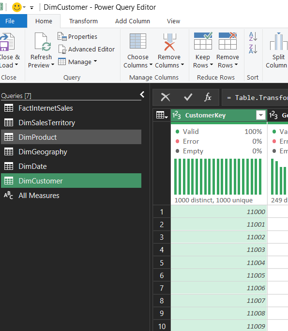
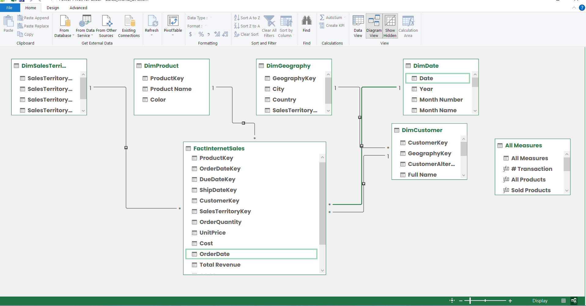
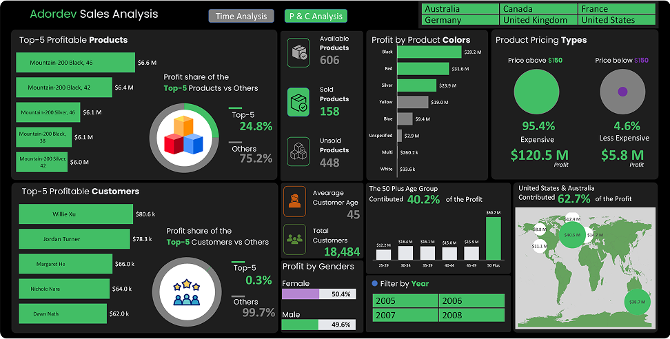
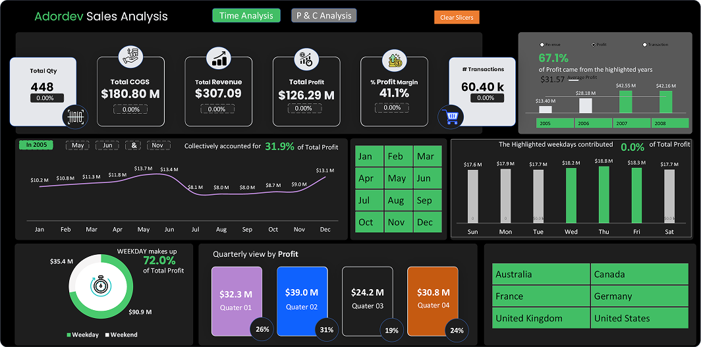

# Adordev Sales Analysis Documentation

## 1. Title
Adordev Sales Analysis Report

## 2. Introduction
This comprehensive documentation presents an in-depth analysis of Adordev's sales performance, derived from a meticulously executed end-to-end project conducted entirely within Microsoft Excel. The report aims to uncover critical trends, identify key profitability drivers, and deliver actionable insights to enhance business strategies and optimize operational efficiency. All stages of this project, including data collection, cleaning, exploratory data analysis (EDA), visualization, statistical analysis, and interpretation, were performed using Excel's robust tools and features, showcasing its capability as a powerful platform for data-driven decision-making.

## 3. About the Data
The dataset utilized in this analysis encompasses a wide range of sales-related metrics for Adordev, spanning from 2005 to 2008. It includes quantitative data such as total quantity sold, cost of goods sold (COGS), total revenue, total profit, and profit margins, alongside categorical data encompassing product types, customer demographics (e.g., age groups, gender), geographic regions, and transaction details. This rich dataset, processed entirely in Excel, provides a solid foundation for a thorough evaluation of Adordev's sales performance over the specified period.

## 4. Methodology

### Data Collection
The data collection phase involved aggregating internal sales records and customer transaction logs from Adordev's operational systems. These records were imported into Excel spreadsheets, ensuring all raw data was centralized for subsequent processing. The dataset was carefully curated to include multi-year data across various regions, providing a comprehensive view of sales activities.

### Data Cleaning & Transformation
All data cleaning and transformation tasks were executed within Excel using a combination of manual checks and automated functions. This process included:
- Removing duplicate entries and addressing missing values through Excel's data validation and filtering tools.
- Standardizing date formats and converting currency values to a consistent unit using Excel formulas and custom scripts.
- Transforming the raw data into a structured format suitable for analysis, leveraging Excel's pivot tables and data modeling capabilities.

**

### Exploratory Data Analysis
The exploratory data analysis (EDA) was conducted entirely in Excel, utilizing its advanced analytical tools. Key variables such as total quantity, COGS, revenue, profit, and profit margin were examined. Excel's charting and data analysis add-ins were employed to identify temporal trends, regional performance variations, and correlations between different metrics, laying the groundwork for deeper insights.

### Visualization
Visual representations were created using Excel's charting tools, including line graphs, bar charts, pie charts, and dashboards. These visualizations effectively illustrated sales trends over time, profit distribution across products and regions, and customer segmentation, all developed within Excel to ensure seamless integration with the analysis workflow.

### Statistical Analysis
Statistical calculations were performed in Excel using built-in functions and statistical tools. This included computing profit contributions, percentage changes, and statistical significance of observed trends, providing a quantitative basis for the subsequent interpretation and recommendations.

### Interpretation & Recommendations
The interpreted results, derived from Excel-based analysis, highlighted key insights into Adordev's sales performance. Recommendations were formulated based on these findings, aiming to guide strategic decisions and enhance profitability, all synthesized within the Excel environment.

## 5. Data Structure Image
**

## 6. Data Model Overview
**

## 7. Analysis
- **Time Analysis**: Detailed examination using Excel revealed that the months of May, June, and November collectively accounted for 31.9% of the total profit in 2005. Time-series analysis was conducted using Excel line charts to track monthly performance trends.
- **P & C Analysis**: Profit and cost analysis, performed with Excel pivot tables and charts, highlighted the top profitable products and customers. Profit margins were analyzed by product color and pricing tiers, showcasing variations across the dataset.

## 8. Dashboards
The dashboards were meticulously crafted in Excel, integrating multiple data visualizations into an interactive interface. These dashboards provide a holistic view of sales metrics, trends, and segment performance.

**
**

## 9. Insights
- The total profit for 2005 was calculated in Excel to be $126.29 million, with a profit margin of 41.1%, derived using Excel formulas.
- Excel's pie chart analysis indicated that weekdays contributed 72.0% of the total profit.
- The top 5 products (e.g., Mountain-200 Black, 46) were identified using Excel's sorting and filtering tools, accounting for 24.8% of the profit.
- Top 5 customers contributed only 0.3% of total profit, as determined by Excel's data summarization.
- The 50+ age group was found to contribute 40.2% of profit, analyzed through Excel's demographic segmentation.
- United States and Australia together contributed 62.7% of profit, calculated using Excel's regional data aggregation.
- 95.4% of profit came from products priced above $150, identified through Excel's pricing tier analysis.

## 10. Recommendations
Based on the Excel-driven analysis, the following recommendations are proposed:
- Focus marketing efforts on weekdays and target the 50+ age group, leveraging Excel's trend insights.
- Prioritize high-margin products (e.g., Mountain-200 Black, 46) in inventory and promotional strategies, identified through Excel's profit analysis.
- Expand market presence in the United States and Australia, supported by Excel's regional profit data.
- Emphasize the premium pricing segment (above $150) for higher profitability, as validated by Excel's pricing analysis.